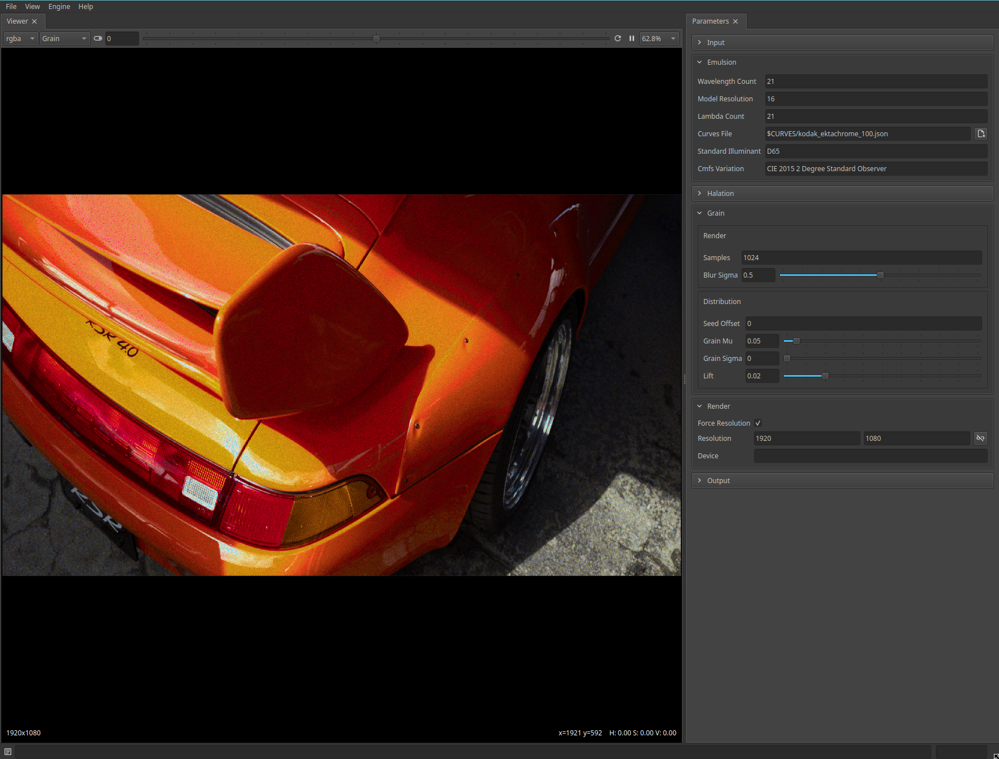

# Autochrome

Autochrome is a tool to synthesize realistic film grain. It is based on the research of
Newson at al (2017).

The name Autochrome is based on the early color photography process [Autochrome Lumière].



[Autochrome Lumière]: https://en.wikipedia.org/wiki/Autochrome_Lumi%C3%A8re

## Installation

Requires [Python 3.10](https://www.python.org/downloads)

```shell
pip install autochrome@https://github.com/beatreichenbach/autochrome/archive/refs/heads/main.zip
python -m autochrome --gui
```

## Links

- [The Challenge of Simulating Grain in Film Stocks of the Past](https://blog.metaphysic.ai/the-challenge-of-simulating-grain-in-film-stocks-of-the-past/)

### Spectral Reconstruction

- [A Low-Dimensional Function Space for Efficient Spectral Upsampling](https://rgl.s3.eu-central-1.amazonaws.com/media/papers/Jakob2019Spectral_3.pdf)
- [Physically Meaningful Rendering using Tristimulus Colours](https://cg.ivd.kit.edu/publications/2015/spectrum/paper-preprint.pdf)
- [Rgb to Spectrum Conversion](http://sv-journal.org/2015-4/03/en/index.php?lang=en)
- [GitHub: caiyuanhao1998/MST-plus-plus](https://github.com/caiyuanhao1998/MST-plus-plus)
- [GitHub: boazarad/NTIRE2022_spectral](https://github.com/boazarad/NTIRE2022_spectral)

### Film

- [Advanced Emulsion](https://www.youtube.com/watch?v=I4_7tW-cx1I)
- [Kodak Portra 800](https://imaging.kodakalaris.com/sites/default/files/files/products/e4040_portra_800.pdf)
- [Fuji: Superia Xtra 800](https://125px.com/docs/film/fuji/superia_xtra800_datasheet.pdf)
- [Kodak: Ektachrome 100](https://imaging.kodakalaris.com/sites/default/files/files/products/e4000_ektachrome_100.pdf)
- [Kodak: Portra 800](https://imaging.kodakalaris.com/sites/default/files/files/products/e4040_portra_800.pdf)

### Grain

- [Realistic Film Grain Rendering](https://www.ipol.im/pub/art/2017/192/article_lr.pdf)
- [YouTube: Film Grain Rendering](https://cg.ivd.kit.edu/publications/2015/spectrum/paper-preprint.pdf)
- [GitHub: alasdairnewson/film_grain_rendering_gpu](https://github.com/alasdairnewson/film_grain_rendering_gpu)
- [GitHub: mitsuba-renderer/rgb2spec](https://github.com/mitsuba-renderer/rgb2spec)
- [GitHub: nbvdkamp/rgb2spec-rs](https://github.com/nbvdkamp/rgb2spec-rs)

### Images

- <https://stocksnap.io/photo/female-portrait-UOBQKFXUIG>
- <https://stocksnap.io/photo/male-portrait-NLX0RAPBGB>
- <https://stocksnap.io/photo/woman-female-JDXWHY8CIN>
- <https://stocksnap.io/photo/female-portrait-NWFLCH8IBN>
- <https://stocksnap.io/photo/woman-beach-FJCOO6JWDP>

## Contributing

Create a virtual environment:
```shell
python -m venv venv
```

Install the development package:
```shell
python -m pip install -e .[dev]
```

To release a new version:
```shell
semantic-release version
```